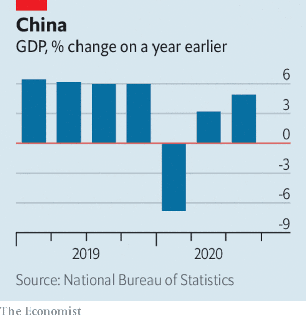

# Business this week

> Oct 22nd 2020

America’s Justice Department sued Google for violating antitrust laws, accusing what it described as “the gatekeeper of the internet” of choking off competition for search engines by striking deals with Apple, mobile-phone carriers and other companies. It is the department’s biggest antitrust suit since taking on Microsoft in 1998. With lots of cash on hand, Google is digging in for a long legal fight. It says there is plenty of competition, pointing to consumers who search and shop on Amazon. See [article](https://www.economist.com//business/2020/10/21/american-trustbusters-take-on-google).

In a busy week, the Justice Department also announced a settlement with Purdue Pharma, the maker of OxyContin, which will plead guilty to criminal charges in relation to the opioid crisis and pay $8.3bn in penalties, the most ever imposed on a drugs company. The Sackler family, which owns Purdue, agreed to pay $225m in related damages.

The space race in cloud computing gathered speed, as Microsoft launched a plan to connect its data centres, operating from anywhere in the world, with low-orbit satellites provided by SpaceX. The project is aimed at private firms and government agencies that gather satellite data but don’t want to spend on ground infrastructure to process the information. Amazon unveiled a similar service in June. See [article](https://www.economist.com//leaders/2020/10/22/is-tech-getting-more-competitive).

Sweden’s telecoms regulator banned Huawei and ZTE from providing equipment for 5G networks following advice from the intelligence services about the potential threat to national security. The move comes ahead of an impending decision from the German government on whether it will also shut out Chinese makers of 5G network equipment.

In another deal that reshapes its business, Intel disclosed that it is selling its NAND solid-state storage division to  sk Hynix, a South Korean chipmaker, for $9bn. Last year Intel sold its smartphone modem business to Apple.

Ant Group received the final regulatory approval for its forthcoming dual listing in Hong Kong and Shanghai. The Chinese fintech firm’s IPO is expected to be world’s largest.

America’s federal government racked up a budget deficit of $3.1trn for the fiscal year ending September 30th, $2trn more than the White House forecast in February when it released its budget. The government spent $6.5trn in all, about a third of it on the covid-19 emergency relief package in March.

China’s economy grew by 4.9% in the third quarter compared with the same three months last year. That was below the expectations of most economists, but an improvement on the second quarter’s 3.2%. The rate of output in Chinese industrial production has returned to pre-pandemic levels and retail sales have picked up. See [article](https://www.economist.com//node/21793479).

Moody’s cut its credit rating on Britain’s sovereign debt by one notch. The rating is still of high quality, though one factor ominously underpinning Moody’s downgrade is the “diminished” quality of Britain’s “legislative and executive institutions”.

More takeover deals were announced in America’s shale energy industry, as companies scramble to consolidate in an oil market beset by falling demand. ConocoPhillips agreed to buy Concho Resources for $9.7bn. And Pioneer Natural Resources said it would acquire Parsley Energy in a $7.6bn transaction.

A study by the OECD warned that covid-19 was slowing the flow of migration, with the number of new residency permits granted to workers in OECD countries down by 46% in the first half of the year compared with the same six months last year, the largest drop on record. The organisation thinks that mobility will not return to previous levels for some time, because of weak labour demand, persistent travel restrictions, the take-up of working from home and remote learning by students.

Netflix pulled in just 2.2m new subscribers in the third quarter, down from the 15.8m and 10m it added in the first and second quarters, when people turned to the video-streaming service during lockdown. Having been a one-man show for years, Netflix now faces competition from Amazon Prime, Disney+ and others. Like its rivals, it has been hampered by pandemic restrictions that have curtailed production of new films and series.

Cathay Pacific said it would shed 8,500 jobs because of the pandemic. Like others in the industry the airline, based in Hong Kong, has been hit hard by flight restrictions and has also had to contend with headwinds from the city’s recent political turbulence. As part of its restructuring its regional airline, Cathay Dragon, has stopped flying.

Heathrow airport began offering speedy virus tests to departing passengers for £80 ($105). It is unclear how many destination countries will accept the results.

## URL

https://www.economist.com/the-world-this-week/2020/10/22/business-this-week
