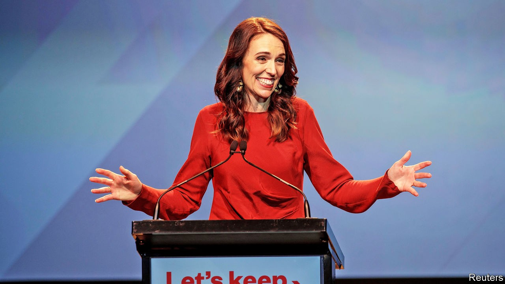
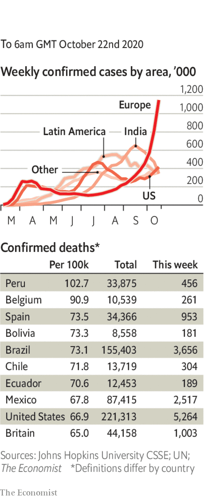

# Politics this week

> Oct 22nd 2020

New Zealand’s Labour Party romped home to secure a fresh term at a general election, winning 49% of the vote and an overall parliamentary majority, the first for any party in the country since proportional representation was adopted in 1996. Jacinda Ardern, the prime minister, has been praised for her handling of the covid-19 outbreak. The centre-right National Party was crushed, taking just 27% of the vote, a defeat it did not envisage when it chose Judith “Crusher” Collins as its leader in July. See [article](https://www.economist.com//node/21793519).

The authorities in Thailand lifted curbs that had been imposed on protests against the government and the role of the monarchy. The restrictions did not work: they enraged people and spurred them to attend huge rallies calling for the prime minister to resign. See [article](https://www.economist.com//node/21793520).

The police force in Sindh, Pakistan’s second-most-populous province, threatened to walk out in protest at what they said was the abduction of their inspector-general by army troops, who pressed him to sign an arrest warrant for the son-in-law of Nawaz Sharif, an exiled former prime minister.

Amid a tense stand-off along a disputed mountainous border, India quickly returned a Chinese soldier who had strayed across the line and got lost. China and India are soon to hold more talks following several skirmishes this year.

Robert Destro, the newly appointed diplomat responsible for American policy on Tibet, held a meeting at the State Department with the head of the Tibetan government-in-exile, Lobsang Sangay. It was the State Department’s first hosting of such a meeting since Mr Sangay took up the position in 2011.

China’s anti-graft agency said it had placed the deputy director of the National Energy Administration under investigation. State media say at least 22 energy-industry officials have been investigated or punished this year.

Samuel Paty, a teacher in France, was beheaded by a young refugee originally from Chechnya. The killer, who was shot by police, acted after a parent condemned Mr Paty on social media for showing his pupils caricatures of the Prophet Muhammad in a lesson on free speech. Emmanuel Macron ordered the closure of one Islamist association; police raided several more. See [article](https://www.economist.com//node/21793492).

Ersin Tatar was elected president of North Cyprus, the Turkish part of the divided island. As a supporter of a two-state model, Mr Tatar’s election is likely to set back efforts to unite Cyprus under a power-sharing model.

Nigerian soldiers fired at protesters who were demonstrating against police violence, killing at least a dozen. Thousands have taken to the streets in recent weeks calling on the government to disband a police unit responsible for murder, torture and theft. See [article](https://www.economist.com//middle-east-and-africa/2020/10/21/peaceful-protesters-against-nigerian-police-violence-are-shot).

At least 13 people were reportedly killed in clashes in Guinea after the opposition candidate declared victory in the presidential election in which he ran against the incumbent, President Alpha Condé. The electoral commission said it was still counting votes.

America will remove Sudan from its list of state sponsors of terrorism after the country agreed to pay $335m in compensation to American victims of terrorist attacks in Kenya and Tanzania in 1998 and in Yemen in 2000.

Boris Johnson, Britain’s prime minister, imposed the strictest “tier 3” pandemic restrictions on Greater Manchester, after talks with local leaders broke down. Financial aid was the sticking point. Andy Burnham, Manchester’s mayor, said the amount of money his city had been offered was “brutal”. South Yorkshire was also placed in tier 3. See [article](https://www.economist.com//node/21793468).

Michel Barnier, the EU’s negotiator with Britain on a post-Brexit trade pact, claimed a deal was “within reach” but acknowledged that compromises were needed on both sides. This came after Mr Johnson declared that time had run out. The talks resumed. See [article](https://www.economist.com//node/21793458).

America’s Supreme Court allowed a law to stand in Pennsylvania that permits officials to count postal votes received up to three days after the presidential election. It is estimated that by October 22nd, 40m people across America had already cast ballots, either by voting early at polling stations or by post. See [article](https://www.economist.com//node/21793474).

Luis Arce, the candidate of the Movement to Socialism, won Bolivia’s presidential election in the first round. He is the political heir of Evo Morales, who was forced from office last year by protests. See [article](https://www.economist.com//node/21793459).

Salvador Cienfuegos, who was Mexico’s defence minister from 2012 to 2018, was arrested at Los Angeles’s airport and charged with drug-trafficking and money laundering.

Brazilian police raided the home of Chico Rodrigues, a senator allied with the president, Jair Bolsonaro, and discovered 30,000 reais ($5,000) wedged between his buttocks. Mr Rodrigues denies diverting funds meant for the pandemic.

Asbestos, a town of 7,000 people in Quebec near a mine from which the toxic mineral was once extracted, voted to change its name to Val-des-Sources (it is near three lakes).

Iran again broke its single-day record for covid-19 deaths. Hospitals in Tehran, the capital, ran out of intensive-care beds and suspended all non-emergency treatments.

Israel eased a month-long nationwide lockdown, its second since the beginning of the pandemic. It has seen a significant decline in the number of new cases.

Health experts cast doubt on the claim by a government panel in India that the virus had reached its peak in the country. Cumulative cases passed 7.7m this week.

Ireland was put back into a strict lockdown. The government had resisted implementing the measures, which scientists were calling for.

The go ahead was given in Britain for the world’s first “human-challenge clinical trials”, in which volunteers will be dosed with the virus.

## URL

https://www.economist.com/the-world-this-week/2020/10/22/politics-this-week
