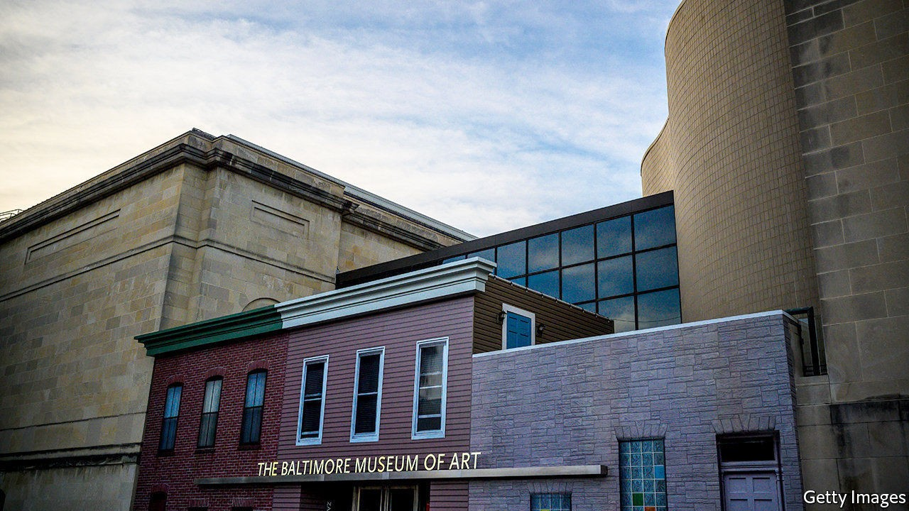

## Going, going, gone

# American museums rush to sell artworks

> A brief relaxing of the rules gives them a window of opportunity

> Oct 22nd 2020

CLYFFORD STILL may have been the most gifted of America’s Abstract Expressionist painters; he was certainly also the most uncompromising. He would suddenly withdraw works he had promised to exhibitions if he considered the curating to be substandard, and he almost never let go of any of his paintings and drawings. When he died in 1980, he still had 2,400 works in his studio.

But Still had made an exception for the painting, in his characteristic jagged strokes of rust and black, which he called “1957-G”. In 1969 he gave this work to the Museum of Art in Baltimore, located 30 miles away from where he and his second wife had settled in rural Maryland eight years earlier. Now the museum is auctioning off the picture, which it hopes might earn it $18m.

“1957-G” is part of a wave of artworks being sold this month by American museums that are taking advantage of a brief loosening of the rules surrounding collections. The Association of Art Museum Directors (AAMD) has long insisted that any money museums gain from such sales can be used only for new acquisitions; it cannot fund shortfalls in revenue when times are hard. In April, though, it agreed to a year-long fillip, which would allow funds from sales to be used for “direct care of the collection”. The Brooklyn Museum joins six other institutions in California, Indiana, Texas, Massachusetts, New Jersey and New York that are hoping to raise tens of millions of dollars by auctioning part of their collections.

Of the $65m that Baltimore hopes to gain from selling the Still and two other paintings, a grey abstract by Brice Marden and Andy Warhol’s famous take on “The Last Supper”, $10m will be used for traditional acquisitions and $55m will go towards an endowment fund to care for the collection, according to Artnet, a website that tracks sales. TheAAMD decision came just as covid-19 was beginning to badly affect museums and other cultural institutions. Baltimore wants to bend the rules and use part of the interest that the endowment will generate to raise salaries for museum staff. Other museums are likely to do the same before the AAMD rules tighten up again in six months’ time.

Whether Still would have approved of how his gift is being treated by Baltimore’s museum is debatable. When he died, he left all the artworks he still owned to any American city that promised to build a museum dedicated entirely to him. Nearly a quarter of a century later, in 2004, his widow signed a deal with Denver, on one condition: that it would never sell a single work by him that was given to the city.

## URL

https://www.economist.com/united-states/2020/10/22/american-museums-rush-to-sell-artworks
