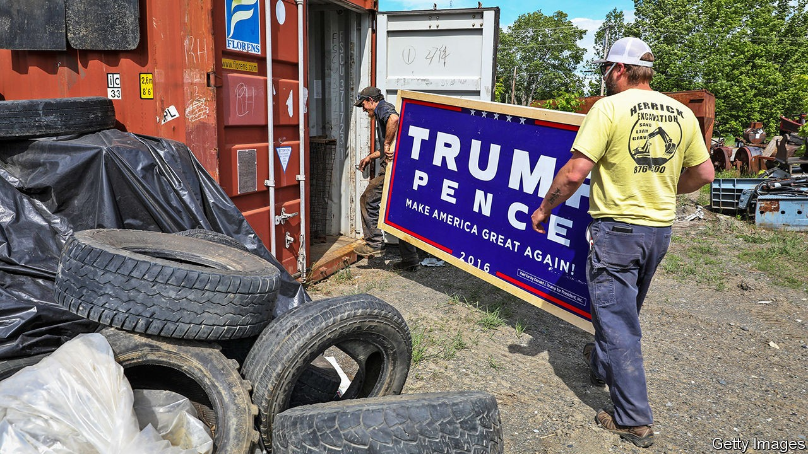

## Tariff man

# An assessment of Donald Trump’s record on trade

> What have the president’s threats and deals achieved?

> Oct 24th 2020WASHINGTON, DC

“WE WILL stand up to trade cheating,” Donald Trump promised in 2016. He pledged to end “the era of economic surrender” and put America first, even if that meant kicking others down. He said he would renegotiate “horrible” trade deals bilaterally, scorning any larger agreement “that ties us up and binds us down”. International trade rules were for suckers. And if other countries refused to play along, he promised tariffs.

Mr Trump’s bite turned out to be almost as bad as his bark. On his first day in office he withdrew America from the Trans-Pacific Partnership (TPP), a deal with 11 other countries around the Pacific Rim. He appointed as United States Trade Representative the hawkish Robert Lighthizer, who proceeded to scupper the World Trade Organisation’s system of settling disputes. Without independent referees, foreign governments with complaints have to negotiate directly with Uncle Sam. 

The president also lived up to his claim of being a “tariff man”. Allies in Europe and Canada took offence at tariffs on their steel and aluminium, both in the name of America’s national security. He lifted average tariffs on Chinese exports from 3% at the beginning of 2018 to 19% today, at first to slam China for its theft of American companies’ intellectual property, and then in retaliation for China’s counter-tariffs. He used threats to push along some deals too, securing narrow agreements with South Korea, Japan and China, as well as the broader USMCA with Mexico and Canada.

Beneath the all-caps tweets and triumphant handshakes, what did this flurry of activity achieve? His team has not solved any of the structural problems afflicting the global trading system, including the distorting effects of China’s industrial subsidies on international markets. But neither has his team achieved nothing.

The bullying did secure concessions. Japan offered access to its agriculture market (though the TPP would have gone further), without gaining any new access to America’s car market. The Mexican government agreed to tight rules for the standards a car would have to meet to enter America tariff-free. And the “phase-one” deal with China scrapped technical barriers to American exports of pork, dairy and beef, made openings for some financial-services companies and allowed for tariffs to return quickly if the Chinese did not play along.

American companies operating in China do not seem to be particularly grateful for the help. A membership survey conducted in May and June by the US-China Business Council, a trade group, found that for 37% of respondents the cost of the tariffs outweighed the benefits of the trade agreement, and 56% said it was too soon to say. But perhaps the trade war was not entirely being fought on their behalf. If the administration was trying to reduce America’s reliance on China as a supplier, the achievements look more obvious.

These successes came at a cost. One study found that the correlation between higher trade uncertainty and depressed global growth meant that the disputes could have dragged back global GDP growth by 1%. A survey run by the Atlanta Federal Reserve found that domestic-goods manufacturers expected tariff increases and trade policy jitters to squash investment in the second half of 2019 by 8%.

The tariffs shuffled resources around: towards American producers of products shielded by the tariffs, away from the businesses and people having to pay for more expensive imports, as well as producers affected by foreign retaliation. One study found that, for manufacturing employment, the depressive effects outweighed the stimulative ones. Another found that the companies facing tariffs accounted for 84% of American exports and 65% of manufacturing employment. Taking an average cost of $900 per worker, those companies’ exports slowed as though they had faced a foreign tariff of 2%.

Although Mr Trump claimed foreigners were paying the $80bn of revenue the tariffs raised, economists found that, in fact, American importers paid it. A complicated process of applying for tariff exclusions left businesses tangled in bureaucracy. Thousands of companies have sued, claiming that some of the tariffs on China are unlawful. The policy has, at the very least, created a bonanza for trade lawyers.

Trump supporters argue that without pain there is no gain. His critics retort that bigger gains could have been achieved for less pain. What if the president had not threatened America’s allies, and instead focused energies on tackling China’s subsidies? What if he had not weakened his own team’s hand, by going back on his word? With the ink barely dry on the USMCA, he threatened Mexico with tariffs. That made other negotiating partners question the point of offering concessions. Mr Trump’s reputation as an unreliable dealmaker limited what his threats could achieve.■

Dig deeper:Read the [best of our 2020 campaign coverage](https://www.economist.com//us-election-2020) and explore our [election forecasts](https://www.economist.com/https://projects.economist.com/us-2020-forecast/president), then sign up for Checks and Balance, our [weekly newsletter](https://www.economist.com//checksandbalance/) and [podcast](https://www.economist.com/https://play.acast.com/podcasts/2020/01/24/checks-and-balance-our-new-weekly-podcast-on-american-politics) on American politics.

## URL

https://www.economist.com/united-states/2020/10/24/an-assessment-of-donald-trumps-record-on-trade
