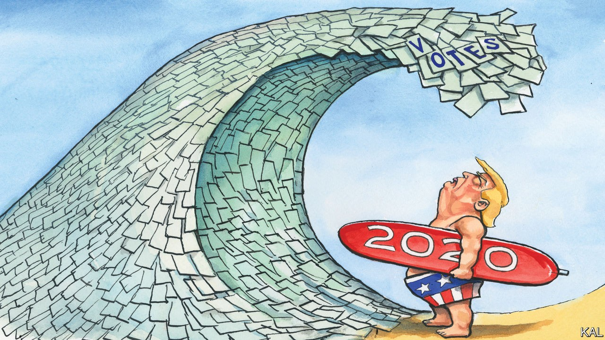

## Lexington

# Donald Trump’s effort to sow mistrust is looking like an own-goal

> Time spent with North Carolina’s early voters suggests a blue wave is on the way

> Oct 24th 2020

PERHAPS IT WAS only a matter of time before the land of billion-dollar election campaigns supersized the vote itself. The great wave of early voting America has experienced over the past two weeks is nonetheless bracing. By the time Donald Trump and Joe Biden are due to hold their debate this week, around 50m ballots will have been cast—almost 40% of the total in 2016. The president, it must be said, is leaving his comeback awfully late.

A tour of polling stations in North Carolina—up and down Interstate 85, which links the battleground state’s main conurbations—illustrated this new voting season. Beginning in the sprawling suburbs of Charlotte, shortly before sunrise, Lexington witnessed voters queuing up around the block, silent or in hushed conversation with a companion, with sometimes a child or two in tow. “I’ve never seen anything like it,” marvelled the Republican commissioner of Union County, Richard Helms, outside a fire-station-site in suburban Indian Trail. His county, on the city’s outer edge, cast 103,000 votes in 2016. Mr Helms expected it to have cast 40,000 by the end of this week.

Proceeding north via Winston-Salem to preppy Durham, then to the former mill-town of Henderson, close to the Virginia border, to visit a last polling-site after sunset, there were similar scenes in each place. A telltale cluster of campaign signs outside a school, fire-station or college building; a steady trickle and often a long line of silent voters; grim head-shakes or nods to the partisan “poll-greeters” handing out their lists of names. And when the voters were asked to say what was most important about this election, a great deal more fear, anguish, and even tears than are usually evident when a mature democracy votes.

“Everything is evil,” exclaimed Claudia, a middle-aged Latina in Indian Trail, to explain why she was taking such pains to vote early. Ahead of her in the line, Beverly, a first-time early-voter and independent, pointed to her T-shirt, which read: “=>÷”. “We need new leadership,” she said—a sentiment that Rob, standing behind her with his wife and bleary-eyed toddler son, munching on Goldfish crackers, did not share. “We’re here because of Biden’s corruption and 47 years in politics without doing anything,” he said.

There is good news here. Despite covid-19, the chaos of decentralised electoral governance, and Republican efforts to exploit it for partisan gain, the election seems—at this early stage—to be going fairly well. Most states have expanded their time-frames and opened more sites for early voting. North Carolina and other states have facilitated kerbside voting, enabling high-risk voters to cast ballots in person. A feared shortage of volunteers seems not to have transpired. Several of the poll-greeters Lexington met had come forward, out of a redoubled sense of duty, for the first time.

Some of the enduring concerns about Republican efforts to suppress non-white votes, in Georgia and Texas especially, have been slightly allayed. In North Carolina, black voters’ ballots are more than twice as likely to be rejected as the average postal vote. Yet they can be resubmitted. A worst-case projection—that 0.4% of Democratic votes could be rejected in the state—should be compared with the rejection of 2% of votes during the primaries.

Worse news is that one of America’s few shared civic rituals has become as politicised as everything else. The early-vote surge has been driven by Democrats—as indicated by the fact that registered Democrats are over one-and-a-half times as likely to have voted as registered Republicans. Most are voting by post. In contrast, registered Republicans, who used to dominate mail-voting, are in most states likelier to vote early in person. This looks like a response to Mr Trump’s insistence that postal voting is “fraudulent”—and another indication that Republicans, again in response to his misinformation, are less careful about covid-19. Almost the only unmasked voters Lexington spoke with were Trumpers. They included the Republican poll-greeter in Indian Trail, a friendly retiree called Phyllis, who said she took a daily handful of vitamins and zinc pills to ward off covid but considered mask-wearing an instrument of pernicious government control “that the whole world is waking up to”.

Republicans and Democrats seem increasingly to inhabit different realities. Little wonder they lined up together in mistrustful silence. “Normally you’re talking and laughing when you come to vote,” said Alejandro, a burly Democrat in Henderson. “This year there’s so much fear and anger everybody’s just doing what they have to do.” Most voters from the city’s black majority said that they were voting in person, despite being worried about covid, because they were afraid their ballot would not count if they mailed it in. And voting was the only form of political expression one woman said she could take part in. For fear of her “violent” white pro-Trump neighbours, she had not dared to display a Democratic sign in her yard this year for the first time. “I decided I’d rather have peace than express myself,” she said, as her eyes filled with tears.

Some of these changes to the country’s electoral culture are likely to be long-lasting. Americans of different races and political hues could end up voting almost as separately as they worship. On the other hand, the immediate cause of their disunity, Mr Trump, seems increasingly likely to be on the way out.

The Democratic early-vote lead does not predict his defeat. It will be somewhat pegged back by his supporters on election day. Yet it is graphic evidence of Democratic enthusiasm—which is in itself likely to generate further enthusiasm. It should also insure the Democrats against late mishaps—such as the tropical storm long-range forecasters foresee in Florida on election day—to which Republicans will remain vulnerable. Moreover, as a boomeranged consequence of the president’s efforts to undercut mail-in voting, the Democratic advantage points to another important factor in Mr Trump’s struggles: his stunning ineptitude.■

Dig deeper:Read the [best of our 2020 campaign coverage](https://www.economist.com//us-election-2020) and explore our [election forecasts](https://www.economist.com/https://projects.economist.com/us-2020-forecast/president), then sign up for Checks and Balance, our [weekly newsletter](https://www.economist.com//checksandbalance/) and [podcast](https://www.economist.com/https://play.acast.com/podcasts/2020/01/24/checks-and-balance-our-new-weekly-podcast-on-american-politics) on American politics.

## URL

https://www.economist.com/united-states/2020/10/24/donald-trumps-effort-to-sow-mistrust-is-looking-like-an-own-goal
