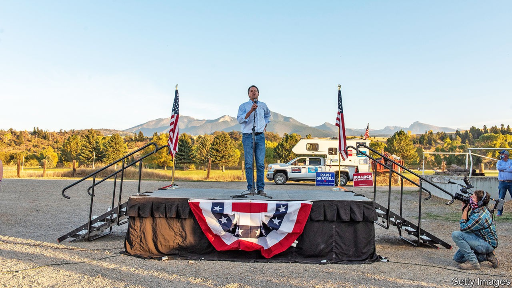

## Gold in them hills

# Mining for votes in Montana

> How to spend $150m on campaigning in a state of 1m people

> Oct 24th 2020BIG TIMBER, MONTANA

THE RESIDENTS of Big Timber, a mining town near the Crazy Mountains in Montana, can’t wait for the elections to end. Campaigning is too exhausting. Each day they must empty a dozen glossy political pamphlets from overstuffed letterboxes. Local television news is interrupted 15 times every half-hour by candidates’ 30-second spots. These are usually fearmongering attacks on rivals, with ominous voice-overs. Negative ads arrive just as frequently on the radio and in digital form. “Ads sneak onto your phone like a snake in the grass,” grumbles one man.

They are right to feel overwhelmed. In all, campaign spending in Montana is likely to pass $150m, smashing all records in the state. “It’s theatre of the absurd, the cost per vote is through the roof,” says a senior figure in a statewide campaign. Even if turnout passes 80%, that money is chasing about 600,000 ballots. Everything is so saturated, he says, he can find no more television advertising inventory to buy. Even when it is available, the cost of a “gross rating point”, a measure of the reach of a given advert, has soared.

Money has gushed from out-of-state to a Senate contest that is unexpectedly close. The outgoing two-term governor, Steve Bullock, a Democrat, may yet topple a first-term incumbent senator, Steve Daines. The Republican, who is closely aligned with Mr Trump, is suffering as the president’s popularity wanes. Mr Bullock, meanwhile, is well-known in Montana, well-liked for his record as governor and has hugely out-raised his rival. In the third-quarter alone he took in $26.8m.

Spending is also exceptionally high in other small and politically important states, such as Maine, where the campaigns may spend $100 on ads for every vote cast. Yet in Montana the outlay could reach $200. Much goes to local television companies. Then consultants take a cut. One says there are “so few people and a tsunami of ads, it’s overwhelming”. Digital firms take a quarter of ad-spending, says Erika Franklin-Fowler of the Wesleyan Media Project, which tracks money in politics. Spending is “through the roof”, she says.

A few local producers get a cut. In Bozeman, JP Gabriel, who runs Filmlites Montana, says he has never seen such an election gold rush in his 32 years of making ads and lighting political rallies: “This kind of amazing boom, oh my God.” He jokes that he has joined the green party—“bring the green and let’s party”. David Parker of Montana State University sees “absolutely crazy” flows of money to races for governor, attorney-general, Senate and a single House seat. He notes campaign outlays for Montana’s population are more than double what is usually spent (some £40m, or $50m) on an entire British national election, for example.

Mr Bullock has long opposed out-of-control election spending, especially through Super PACs, political action committees that operate alongside candidates’ campaigns. Last year, in his run to be the Democratic presidential nominee, he vowed to fight “a corrupt system that lets campaign money drown out the people’s voice”. This time round, most of the drowning-out is being done for his benefit.

Does the deluge make a difference? Campaigning is easier, notes Jason Thielman, chief-of-staff to Mr Daines: “You don’t have to choose between your children, we can do both digital and TV”. But diminishing returns kick in as voters face their 10,000th ad alleging that Mr Daines does the bidding of Chinese masters, or that Mr Bullock is soft on guns. ■

Dig deeper:Read the [best of our 2020 campaign coverage](https://www.economist.com//us-election-2020) and explore our [election forecasts](https://www.economist.com/https://projects.economist.com/us-2020-forecast/president), then sign up for Checks and Balance, our [weekly newsletter](https://www.economist.com//checksandbalance/) and [podcast](https://www.economist.com/https://play.acast.com/podcasts/2020/01/24/checks-and-balance-our-new-weekly-podcast-on-american-politics) on American politics.

## URL

https://www.economist.com/united-states/2020/10/24/mining-for-votes-in-montana
