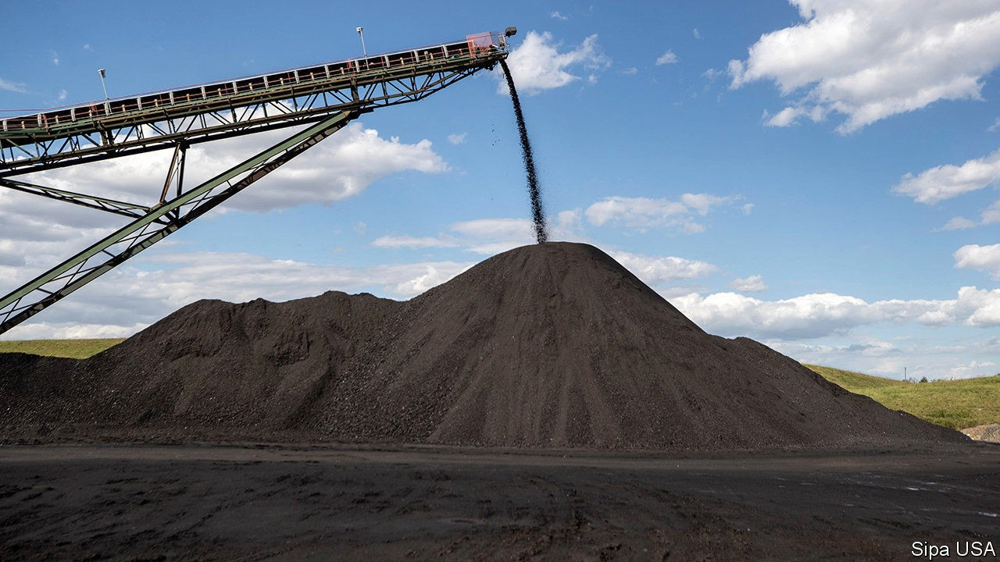

## Pumped up

# What Donald Trump did for hydrocarbons

> The president has pursued a high-risk, low-reward energy strategy

> Oct 24th 2020NEW YORK

AS LEADERS IN Europe and China push their countries towards clean energy, Donald Trump is proud to tug in the opposite direction. In 2016 he promised to save American coal. In 2020 he has championed “energy dominance” and cast himself as fracking’s last defence against a looming leftist assault. Indeed, Mr Trump would seem to be responsible for a golden age for carbon-emitters. During his presidency America has become the world’s largest producer of crude oil, a big shift for a country that has fretted over energy security for decades. Yet America’s oil boom is subsiding and coal-fired power in decline.

That is despite Mr Trump’s best efforts. “We will never again be reliant on hostile foreign suppliers,” the president declared in July. “And we will defend America’s newfound energy independence.”

His Environmental Protection Agency has, among other things, sought to weaken requirements for reducing greenhouse-gas emissions in the power sector, undermine the legal basis for limiting coal plants’ mercury emissions, loosen fuel-efficiency standards for cars and ease rules for oil and gas producers’ emissions of methane. To invite more drilling, Mr Trump is in the process of removing protection from a swathe of public lands larger than Austria and Switzerland combined.

Many measures remain mired in court. For all Mr Trump’s talk of deregulation, his administration’s rulemaking and litigation have been inept. “Imagine where we’d be if they knew what they were doing,” says David Doniger of the NRDC Action Fund, an environmental lobby group.

If Mr Trump is re-elected, there is a greater chance that his new rules become permanent, particularly if the Supreme Court affirms his interpretation of the Clean Air Act. Less efficient cars would remain on the road, boosting demand for petrol. Coal plants might avoid installing new scrubbers, making them dirtier and, by lowering their costs, extending their lives. It would be harder to curb emissions of methane, a greenhouse gas which over 20 years is 84 times more potent than carbon dioxide. More land could see drilling, including the Arctic National Wildlife Refuge, home to caribou and polar bears. The Rhodium Group, a research outfit, estimates that Mr Trump’s policies might add 1.8 gigatonnes of carbon-dioxide to the atmosphere by 2035. None of this, however, would ensure a revival for coal or a sustained surge in oil and gas production.

Start with coal. Coal-mining employment slumped by 5% from 2016 to 2019, despite Mr Trump’s campaign promises. Coal-fired power-generation has dropped by 22% over the same period, threatened by cheap gas and, increasingly, cheap renewables. Four years ago American coal produced twice as much electricity as renewables did; this year renewable power is poised to match the coal-fired kind for the first time ever, according to the government’s most recent forecast. Mr Trump’s changes might ensure that some coal plants stay open longer and emit more harmful gases. But they would not prevent the sector from decline.

America’s oil and gas dominance also looks rather wobbly. America’s fracking bonanza began under Barack Obama, as oilmen found new ways to blast hydrocarbons from layers of shale. It was Mr Obama who signed a bill ending a 40-year ban on crude oil exports, opening new markets to American producers. During Mr Trump’s presidency, sanctions on Iran and Venezuela, two petrostates, have supported oil prices, but his trade war with China has depressed them. The limit of America’s oil power has also become evident.

Rising American output does not mean the country is independent —in 2019 it imported 9.1m barrels a day of foreign petroleum. Nor is America immune from swings in the global market. Last year crude prices spiked after an attack on oil facilities in Saudi Arabia. Because America’s oil industry has grown, says Jason Bordoff of Columbia University, “we are more vulnerable to the economic harm that comes from an oil price collapse.” When Mr Trump faced sinking prices this year, he had to ask Riyadh and Moscow to cut output. “The consequence,” Mr Bordoff argues, “was to strengthen the relationship between Saudi Arabia and Russia.”

Oil and gas companies themselves are in turmoil. Even before covid-19 ravaged oil demand, investors had fallen out of love with American shale, fed up with poor returns and the continuous need for reinvestment. Last year an index of American exploration and production companies sank by nearly 20%, compared with a jump of almost 30% for the S&P 500. If Mr Trump succeeds in auctioning leases in the Arctic, it may be at fire-sale prices. Several big companies, including BP and Royal Dutch Shell, have already left Alaska.

More surprising, then, than Mr Trump’s support of the fossil-fuel industry is how little he has improved its prospects. Yet the sector would still far prefer a second Trump term to a President Joe Biden. The Democratic nominee would not ban fracking, as Mr Trump claims, but he would seek to end new oil and gas leasing on federal lands. More important, Mr Biden’s effort to reduce greenhouse-gas emissions—for instance, through a target for clean power and support for infrastructure and electric cars—would sap broader demand for hydrocarbons. “It would be a real, dramatic shift,” says Frank Macchiarola of American Petroleum Institute, the oil industry’s main lobby. Investors have already placed their bets. Since the start of the year the value of a the S&P Global Clean-Energy Index has climbed by 70%. ■

Dig deeper:Read the [best of our 2020 campaign coverage](https://www.economist.com//us-election-2020) and explore our [election forecasts](https://www.economist.com/https://projects.economist.com/us-2020-forecast/president), then sign up for Checks and Balance, our [weekly newsletter](https://www.economist.com//checksandbalance/) and [podcast](https://www.economist.com/https://play.acast.com/podcasts/2020/01/24/checks-and-balance-our-new-weekly-podcast-on-american-politics) on American politics.

## URL

https://www.economist.com/united-states/2020/10/24/what-donald-trump-did-for-hydrocarbons
