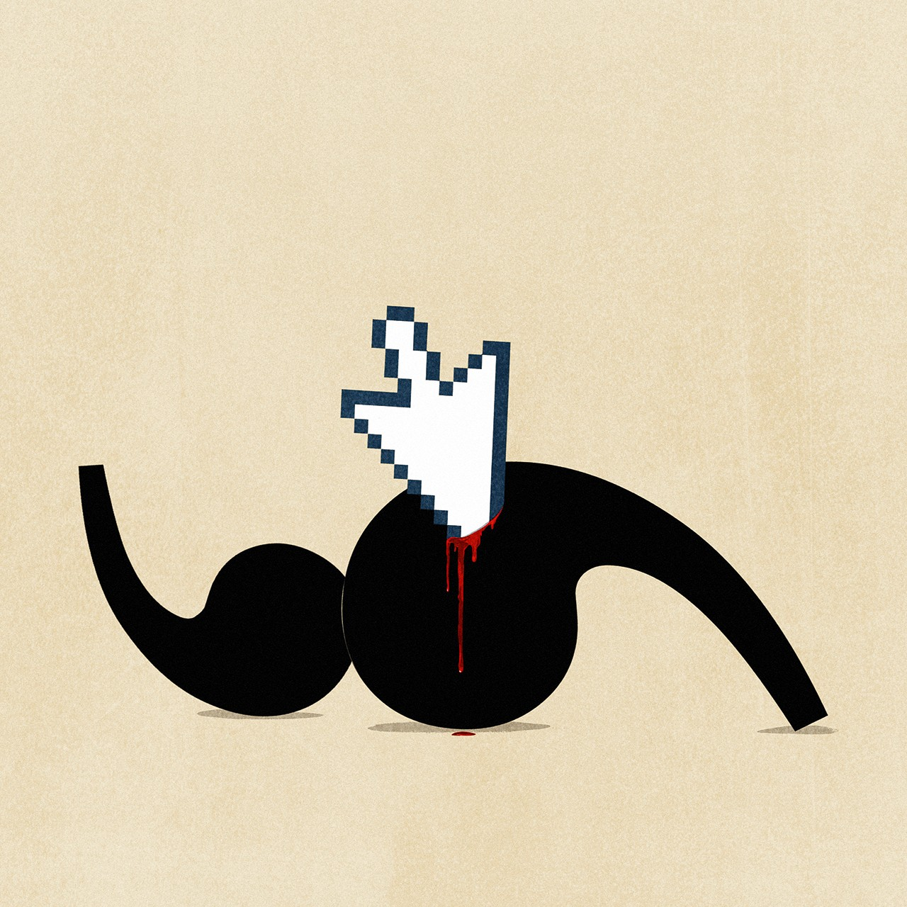

## Who controls the conversation? Social media and free speech

### The world this week
#### [Politics this week](./The%20world%20this%20week/politics-this-week.md)
#### [Business this week](./The%20world%20this%20week/business-this-week.md)
#### [Kals cartoon](./The%20world%20this%20week/kals-cartoon.md)
### Leaders
#### [How to deal with free speech on social media](./Leaders/how-to-deal-with-free-speech-on-social-media.md)
#### [How a no deal brexit can be avoided](./Leaders/how-a-no-deal-brexit-can-be-avoided.md)
#### [Is tech getting more competitive](./Leaders/is-tech-getting-more-competitive.md)
#### [In defence of millennial investors](./Leaders/in-defence-of-millennial-investors.md)
#### [Illicit fishing devastates the seas and abuses crews](./Leaders/illicit-fishing-devastates-the-seas-and-abuses-crews.md)
### Letters
#### [Letters to the editor](./Letters/letters-to-the-editor.md)
### Briefing
#### [Social medias struggle with self censorship](./Briefing/social-medias-struggle-with-self-censorship.md)
#### [How satya nadella turned microsoft around](./Briefing/how-satya-nadella-turned-microsoft-around.md)
### Asia
#### [In myanmar facebook struggles with a deluge of disinformation](./Asia/in-myanmar-facebook-struggles-with-a-deluge-of-disinformation.md)
#### [North korea is lonelier than ever](./Asia/north-korea-is-lonelier-than-ever.md)
#### [A hard task ahead for jacinda arderns new government](./Asia/a-hard-task-ahead-for-jacinda-arderns-new-government.md)
#### [Indian stoners face a moral crusade](./Asia/indian-stoners-face-a-moral-crusade.md)
#### [The pandemic has exposed south east asias poor governance](./Asia/the-pandemic-has-exposed-south-east-asias-poor-governance.md)
### China
#### [Apparatchiks and academics alike struggle to take chinas pulse](./China/apparatchiks-and-academics-alike-struggle-to-take-chinas-pulse.md)
#### [In a world mired in recession china manages a v shaped recovery](./China/in-a-world-mired-in-recession-china-manages-a-v-shaped-recovery.md)
#### [Chinas half loving half threatening pitch to taiwan doesnt work](./China/chinas-half-loving-half-threatening-pitch-to-taiwan-doesnt-work.md)
### United States
#### [If donald trump were to win re election how would he do it](./United%20States/if-donald-trump-were-to-win-re-election-how-would-he-do-it.md)
#### [What donald trump did for hydrocarbons](./United%20States/what-donald-trump-did-for-hydrocarbons.md)
#### [An assessment of donald trumps record on trade](./United%20States/an-assessment-of-donald-trumps-record-on-trade.md)
#### [Mining for votes in montana](./United%20States/mining-for-votes-in-montana.md)
#### [American museums rush to sell artworks](./United%20States/american-museums-rush-to-sell-artworks.md)
#### [Who could object to the equality act](./United%20States/who-could-object-to-the-equality-act.md)
#### [Donald trumps effort to sow mistrust is looking like an own goal](./United%20States/donald-trumps-effort-to-sow-mistrust-is-looking-like-an-own-goal.md)
### Middle East & Africa
#### [Another sham election highlights egypts problems](./Middle%20East%20&%20Africa/another-sham-election-highlights-egypts-problems.md)
#### [Leaders in the middle east are watching the polls in america](./Middle%20East%20&%20Africa/leaders-in-the-middle-east-are-watching-the-polls-in-america.md)
#### [President magufuli is likely to win an unfair vote in tanzania](./Middle%20East%20&%20Africa/president-magufuli-is-likely-to-win-an-unfair-vote-in-tanzania.md)
#### [African governments are outsourcing their natural areas](./Middle%20East%20&%20Africa/african-governments-are-outsourcing-their-natural-areas.md)
#### [Peaceful protesters against nigerian police violence are shot](./Middle%20East%20&%20Africa/peaceful-protesters-against-nigerian-police-violence-are-shot.md)
### The Americas
#### [Chiles momentous referendum on its constitution](./The%20Americas/chiles-momentous-referendum-on-its-constitution.md)
#### [Dont mess up bolivias miracle](./The%20Americas/dont-mess-up-bolivias-miracle.md)
### Europe
#### [A second wave of covid 19 sends much of europe back into lockdown](./Europe/a-second-wave-of-covid-19-sends-much-of-europe-back-into-lockdown.md)
#### [Sweden embarks on its largest military build up for decades](./Europe/sweden-embarks-on-its-largest-military-build-up-for-decades.md)
#### [An exiled ex president plans a comeback in georgia](./Europe/an-exiled-ex-president-plans-a-comeback-in-georgia.md)
#### [A jihadist beheading spurs the french to defend secularism](./Europe/a-jihadist-beheading-spurs-the-french-to-defend-secularism.md)
#### [The european parliament powerful yet puny](./Europe/the-european-parliament-powerful-yet-puny.md)
### Britain
#### [What brexit will do to the city of london](./Britain/what-brexit-will-do-to-the-city-of-london.md)
#### [The fight between central government and city mayors over lockdown](./Britain/the-fight-between-central-government-and-city-mayors-over-lockdown.md)
#### [Will boris johnson keep his promise to reform social care](./Britain/will-boris-johnson-keep-his-promise-to-reform-social-care.md)
#### [State aid data adequacy and britains tech ambitions](./Britain/state-aid-data-adequacy-and-britains-tech-ambitions.md)
#### [What joe biden means for boris johnson](./Britain/what-joe-biden-means-for-boris-johnson.md)
### International
#### [Illegal fishing fleets plunder the oceans](./International/illegal-fishing-fleets-plunder-the-oceans.md)
### Business
#### [Italy spa offers an object lesson in corporate decline](./Business/italy-spa-offers-an-object-lesson-in-corporate-decline.md)
#### [American trustbusters take on google](./Business/american-trustbusters-take-on-google.md)
#### [Meet nextera americas most valuable energy firm](./Business/meet-nextera-americas-most-valuable-energy-firm.md)
#### [What the armed forces can teach business](./Business/what-the-armed-forces-can-teach-business.md)
#### [Who owns the webs data](./Business/who-owns-the-webs-data.md)
### Finance & economics
#### [Wall street will soon have to take millennial investors seriously](./Finance%20&%20economics/wall-street-will-soon-have-to-take-millennial-investors-seriously.md)
#### [Ngozi okonjo iweala is the favourite to lead the wto](./Finance%20&%20economics/ngozi-okonjo-iweala-is-the-favourite-to-lead-the-wto.md)
#### [The front runner for joe bidens treasury boss has a mighty cv](./Finance%20&%20economics/the-front-runner-for-joe-bidens-treasury-boss-has-a-mighty-cv.md)
#### [Who decides what counts as an emerging market](./Finance%20&%20economics/who-decides-what-counts-as-an-emerging-market.md)
#### [Price gouging a cautionary tale](./Finance%20&%20economics/price-gouging-a-cautionary-tale.md)
#### [How berlin has become a centre for european venture capital](./Finance%20&%20economics/how-berlin-has-become-a-centre-for-european-venture-capital.md)
#### [Can too many brainy people be a dangerous thing](./Finance%20&%20economics/can-too-many-brainy-people-be-a-dangerous-thing.md)
#### [Wanted a new writer to cover finance](./Finance%20&%20economics/wanted-a-new-writer-to-cover-finance.md)
### Science & technology
#### [Should covid be left to spread among the young and healthy](./Science%20&%20technology/should-covid-be-left-to-spread-among-the-young-and-healthy.md)
#### [A driverless lorry takes on the top gear track](./Science%20&%20technology/a-driverless-lorry-takes-on-the-top-gear-track.md)
#### [An american spacecraft osiris rex grabs a bit of an asteroid](./Science%20&%20technology/an-american-spacecraft-osiris-rex-grabs-a-bit-of-an-asteroid.md)
#### [Fences are bad for wildlife](./Science%20&%20technology/fences-are-bad-for-wildlife.md)
### Books & arts
#### [Giving up on politics is often tempting it is also risky](./Books%20&%20arts/giving-up-on-politics-is-often-tempting-it-is-also-risky.md)
#### [Ayad akhtar is a bard of american discontent](./Books%20&%20arts/ayad-akhtar-is-a-bard-of-american-discontent.md)
#### [The tragic idealism of the international brigades](./Books%20&%20arts/the-tragic-idealism-of-the-international-brigades.md)
#### [The curious design features of north korean hotels](./Books%20&%20arts/the-curious-design-features-of-north-korean-hotels.md)
### Economic & financial indicators
#### [Economic data commodities and markets](./Economic%20&%20financial%20indicators/economic-data-commodities-and-markets.md)
### Graphic detail
#### [Postal voting could put americas democrats at a disadvantage](./Graphic%20detail/postal-voting-could-put-americas-democrats-at-a-disadvantage.md)
### Obituary
#### [Samuel paty was killed on october 16th](./Obituary/samuel-paty-was-killed-on-october-16th.md)
