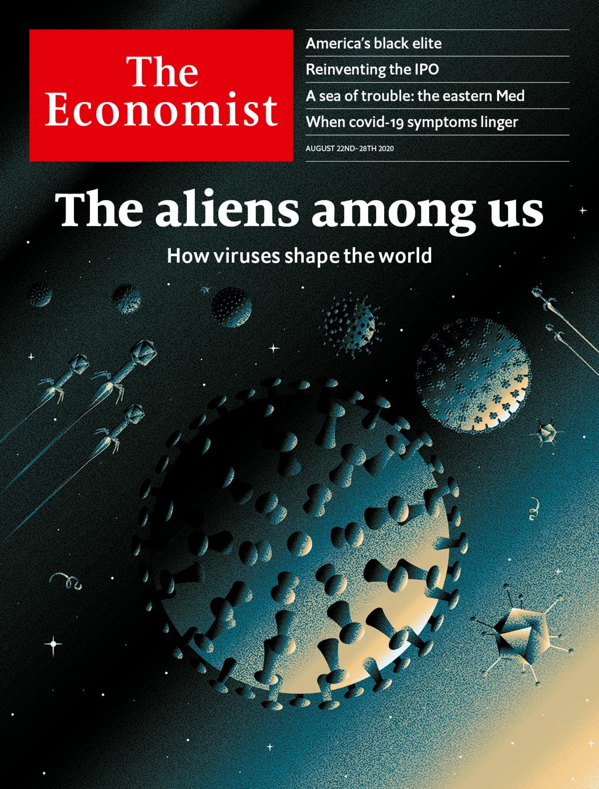
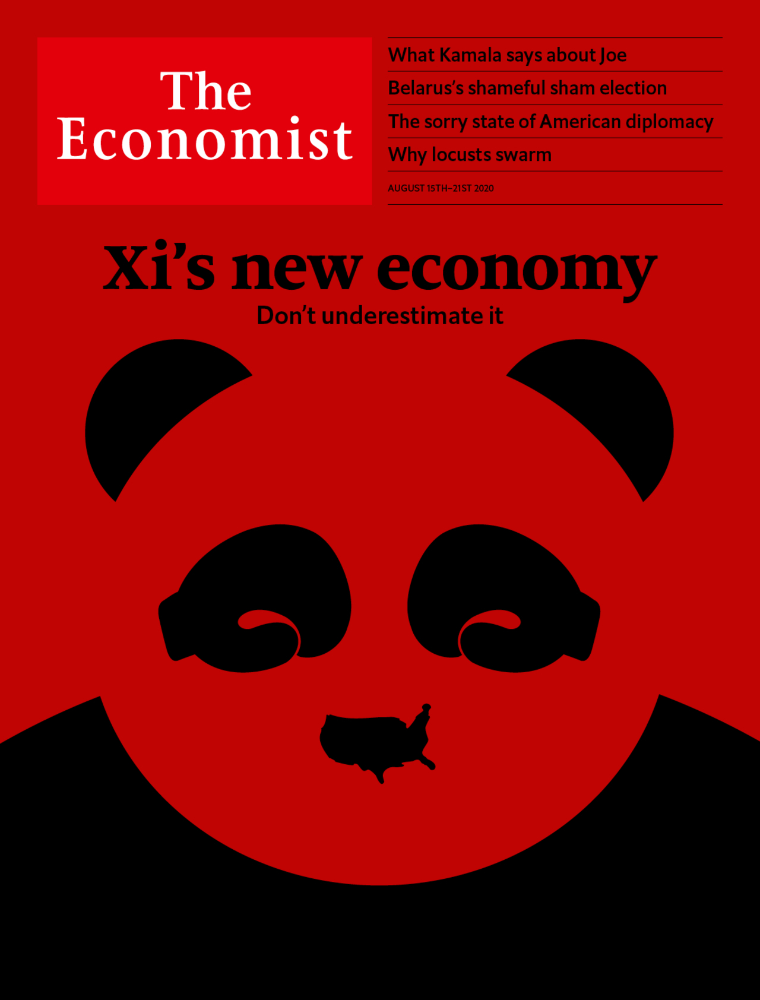
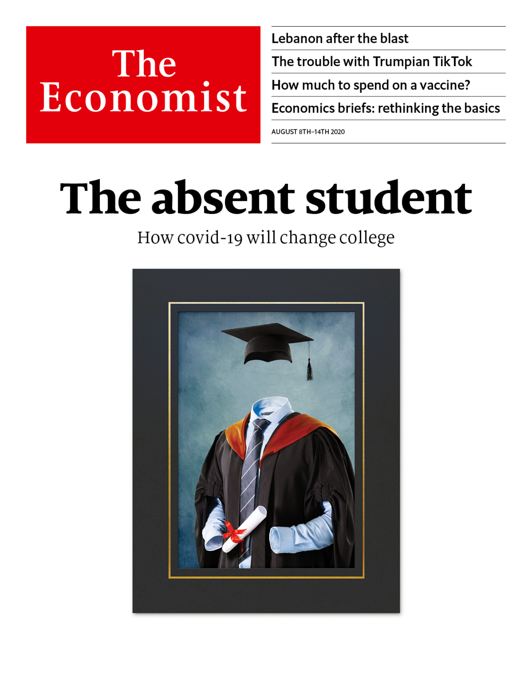

# Economist 2020
<table><tr><td>

2020-09-05

<a href='./2020-09-05'>How Abe changed Japan</a>
</td><td>

2020-08-29

<a href='./2020-08-29'>What Putin fears</a>
</td><td>

2020-08-22

<a href='./2020-08-22'>The aliens among us: How viruses shape the world</a>
</td><td>

2020-08-15

<a href='./2020-08-15'>Xi’s new economy. Don’t underestimate it</a>
</td></tr><tr><td>

2020-08-08

<a href='./2020-08-08'>The absent student: How covid-19 will change college</a>
</td><td>

2020-08-01

<a href='./2020-08-01'>Locked out: When and how to let migrants move again</a>
</td><td>

2020-07-25

<a href='./2020-07-25'>Free money: When government spending knows no limits</a>
</td><td>

2020-07-18

<a href='./2020-07-18'>Trade without trust: How the West should do business with China</a>
</td></tr><tr><td>

2020-07-11

<a href='./2020-07-11'>The new ideology of race: and what’s wrong with it</a>
</td><td>

2020-07-04

<a href='./2020-07-04'>Retro or radical?</a>
</td><td>

2020-06-27

<a href='./2020-06-27'>The next catastrophe (and how to survive it)</a>
</td><td>

2020-06-20

<a href='./2020-06-20'>The new world disorder</a>
</td></tr><tr><td>

2020-06-13

<a href='./2020-06-13'>The power of protest</a>
</td><td>

2020-06-06

<a href='./2020-06-06'>The fire this time: Police violence, race and protest in America</a>
</td><td>

2020-05-30

<a href='./2020-05-30'>China has launched rule by fear in Hong Kong</a>
</td><td>

2020-05-23

<a href='./2020-05-23'>Seize the moment: The chance to flatten the climate curve</a>
</td></tr><tr><td>

2020-05-16

<a href='./2020-05-16'>Goodbye globalisation: The dangerous lure of self-sufficiency</a>
</td><td>

2020-05-09

<a href='./2020-05-09'>A dangerous gap: The markets v the real economy</a>
</td><td>

2020-05-02

<a href='./2020-05-02'>The 90% economy</a>
</td><td>

2020-04-25

<a href='./2020-04-25'>Your country needs me: A pandemic of power grabs</a>
</td></tr><tr><td>

2020-04-18

<a href='./2020-04-18'>Is China winning? The geopolitical consequences of covid-19</a>
</td><td>

2020-04-11

<a href='./2020-04-11'>The business of survival: How covid-19 will reshape global commerce</a>
</td><td>

2020-04-04

<a href='./2020-04-04'>A grim calculus: The stark choices between life, death and the economy</a>
</td><td>

2020-03-28

<a href='./2020-03-28'>The next calamity: Covid-19 in the emerging world</a>
</td></tr><tr><td>

2020-03-21

<a href='./2020-03-21'>Closed</a>
</td><td>

2020-03-14

<a href='./2020-03-14'>The politics of pandemics</a>
</td><td>

2020-03-07

<a href='./2020-03-07'>The right medicine for the world economy</a>
</td><td>

2020-02-29

<a href='./2020-02-29'>It’s going global</a>
</td></tr><tr><td>

2020-02-22

<a href='./2020-02-22'>Big tech’s $2trn bull run</a>
</td><td>

2020-02-15

<a href='./2020-02-15'>A united Ireland: Could it really happen?</a>
</td><td>

2020-02-08

<a href='./2020-02-08'>Meet the new boss: What it takes to be a CEO in the 2020s</a>
</td><td>

2020-02-01

<a href='./2020-02-01'>How bad will it get?</a>
</td></tr><tr><td>

2020-01-25

<a href='./2020-01-25'>Intolerant India: How Modi is endangering the world’s biggest democracy</a>
</td><td>

2020-01-18

<a href='./2020-01-18'>The horrible housing blunder: Why the obsession with home ownership is so harmful</a>
</td><td>

2020-01-11

<a href='./2020-01-11'>Masterstroke or madness?</a>
</td><td>

2020-01-04

<a href='./2020-01-04'>Poles apart: China, America and the planet's biggest break-up</a>
</td></tr></table>